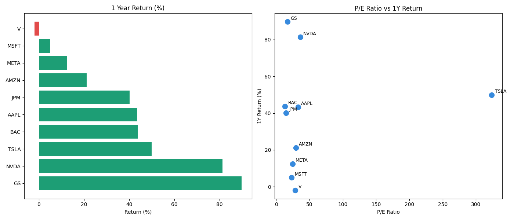

# Stock Screener

A Python tool that pulls live market data for 10 stocks and ranks them by performance and valuation metrics.

## What it does
- Fetches live price, P/E ratio, market cap and volatility for any list of stocks
- Ranks stocks by 1 year return
- Generates a bar chart and P/E vs return scatter plot
- Exports results to a CSV file

## Built with
- Python
- pandas
- yfinance
- matplotlib

## Output

